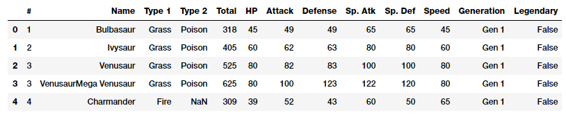
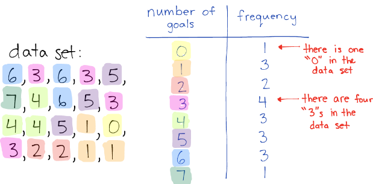
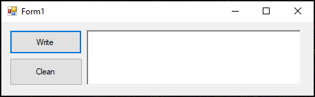
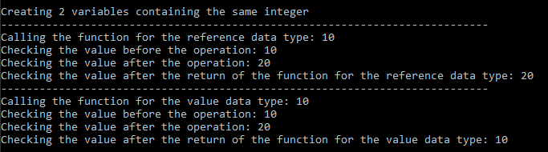

## Researches about theory (R)
<!---
    1_R. Describe the notion of statistical population. What is a population in Descriptive Statistics and what is a population in Inferential Statistics: point out the differences.
-->
1. **Statistical Population** 
    can be defined as set of objects or events sharing at least one common property which is of interest for some experiment, it could also be said to be an aggregate observation of subjects grouped together by a common feature.

    

    This definition can be further extended when looking at its definition for the 2 branches of statistics:

    - **In descriptive statistics:**
        The population is the entire group of objects that share the common feature to be analysed. 

    - **In inferential statistics:**
        The population can be indefinitely large since the statistical analysis is conducted on a subset of the population.
    
    *Sources:*
    - [Wikipedia: Statistical Population](https://en.wikipedia.org/wiki/Statistical_population)
    - [Investopedia: Population](https://www.investopedia.com/terms/p/population.asp)
    - [Statista: Definition Population](https://www.statista.com/statistics-glossary/definition/311/population/)
<!--
    2_R. Describe the notion of statistical attributes/variables and dataset, and explain how a dataset is generated.
-->
2. **Statistical Attributes/Variables**
    are the characteristics or qualities of the individuals, objects or events (also known as statistical units) from a population on which a statistical study is based. 

    These variables can be then subdivided in the following categories:
    - Qualitative variable: non numerical qualities that can be either:
        - Qualitative nominal: an attribute that cannot be ordered.
        - Qualitative ordinal: an attribute that can be ordered.

    - Quantitative variable: numerical variables that we can operate with, also divided in 2 subcategories:
        - Quantitative discrete: the variable can only assume isolated numbers
        - Quantitative continuous: the studied variable can take any value

    

    **Dataset**
    is defined as a collection of data, from an statistical point of view we could define it as the collection of data we gain from the observations of our population of interest. 

    A dataset can be generated through the collection of data from a given population, this information is then organised in a matrix or table where the rows are the statistical units while the columns are the statistical attributes.


    *Sources:* 
    - [Sangakoo: Statistical Variables](https://www.sangakoo.com/en/unit/statistical-variables)
    - [Scolab: Statistical Attribute](https://lexique.netmath.ca/en/statistical-attribute/)
    - [Wikipedia: Dataset](https://en.wikipedia.org/wiki/Data_set)
    - [Towards data science: Generate your sample dataset](https://towardsdatascience.com/generate-your-sample-dataset-a-must-have-skill-for-data-scientists-36ded8600b79)

<!--
    3_R. Explain the differences between a (univariate) dataset and  a (univariate)  frequency distribution. Given a distribution can we reconstruct the dataset? why ?
    How would you describe the change of amount of information passing from the dataset to the distribution?
-->
3. **Differences between a dataset and a frequency distribution**
    
    Frequency Distribution can be defined as the representation of the number of observations within a given interval. mean while a dataset may include all the collected data given by each statistical unit, on the other hand the frequency distribution ignores the single statistical unit in order to convey sn overall view of the number of statistical units that can be grouped in an specific set of values assumed by an statistical attribute.

    

    Given a distribution we cannot reconstruct the dataset since the information given by the distribution generalise the information of each statistical unit, sometimes even grouping them in intervals, giving no option to infer the actual value given by the unit.

    Information as stated above gets reduced as the dataset may extra information that may not be needed for a given study, but the overall understating of the data could be improve since the distribution allows to quantify the members with a given characteristic.

    *Sources:*
    - [Wikipedia: Frequency distribution](https://en.wikipedia.org/wiki/Frequency_distribution)
    - [Investopedia: Frequency distribution](https://www.investopedia.com/terms/f/frequencydistribution.asp)

## Applications / Practice (A)
Complete projects for this assignments can be found at: https://github.com/AlZeck/statistcsApplicationHomeworks

<!---
    1_A. Create - in both languages C# and VB.NET - a program which does the following simple tasks:
        when a button is pressed some text appears in a richtexbox on the startup form
        when another button is pressed the richtextbox is cleared
        when the mouse enters the richtextbox, the richtext backcolor is switched to another color
        when the mouse leaves the richtextbox, the richtext backcolor is reset to its original state
-->
1. Given the following form created using visual studio

    

    the needed code in order to handle the events will be the following
    
    **C#**
    ```cs
    private void WriteButton_Click(object sender, EventArgs e)
    {
        this.richTextBox1.Text = "Hello World!";
    }

    private void CleanButton_Click(object sender, EventArgs e)
    {
        this.richTextBox1.Text = "";
    }

    private void ChangeColor_MouseEnter(object sender, EventArgs e)
    {
        this.richTextBox1.BackColor = System.Drawing.Color.Aqua;
    }

    private void ChangeColor_MouseLeave(object sender, EventArgs e)
    {
        this.richTextBox1.BackColor = System.Drawing.Color.White;
    }
    ```
    **VB .NET**
    ```vb
    Private Sub WriteButton_Click(sender As Object, e As EventArgs) Handles Button1.Click
        Me.RichTextBox1.Text = "Hello World"
    End Sub

    Private Sub CleanButton_Click(sender As Object, e As EventArgs) Handles Button2.Click
        Me.RichTextBox1.Text = ""
    End Sub

    Private Sub ChangeColor_MouseEnter(sender As Object, e As EventArgs) Handles RichTextBox1.MouseEnter
        Me.RichTextBox1.BackColor = System.Drawing.Color.Aqua
    End Sub

    Private Sub ChangeColor_MouseLeave(sender As Object, e As EventArgs) Handles RichTextBox1.MouseLeave
        Me.RichTextBox1.BackColor = System.Drawing.Color.White
    End Sub
    ```
   
<!--
    2_A. Create or search, in both languages C# and VB.NET, some simple but illuminating example of code which clearly shows the different behaviors of reference value data types and value type data types.
-->
2. 
    Using Classes and Structures we can create a simple console app example which shows how these data types behave 
    
    
    **C#**
    ```cs
    class MyRefInt
    {
        public int i; 
        public MyRefInt(int i)
        {
            this.i = i;
        }
    }
    struct MyValInt
    {
        public int i; 
        public MyValInt(int i)
        {
            this.i = i;
        }
    }

    class Program
    {
        public static void Add10AndPrintRef(MyRefInt curr)
        {
            Console.WriteLine("Checking the value before the operation: " + curr.i);
            curr.i += 10;            
            Console.WriteLine("Checking the value after the operation: "+ curr.i);
        }

        public static void Add10AndPrintVal(MyValInt curr)
        {
            Console.WriteLine("Checking the value before the operation: " + curr.i);
            curr.i += 10;
            Console.WriteLine("Checking the value after the operation: " + curr.i);
        }


        static void Main(string[] args)
        {
            Console.WriteLine("Creating 2 variables containing the same integer");
            
            MyValInt value = new MyValInt(10);
            MyRefInt refer = new MyRefInt(10);

            Console.WriteLine("------------------------------------------------------------");

            Console.WriteLine("Calling the function for the reference data type: " + refer.i);
            Add10AndPrintRef(refer);
            Console.WriteLine("Checking the value after the return of the function " + 
                                "for the reference data type: " + refer.i);

            Console.WriteLine("------------------------------------------------------------");

            Console.WriteLine("Calling the function for the value data type: " + value.i);
            Add10AndPrintVal(value);
            Console.WriteLine("Checking the value after the return of the function " + 
                                "for the value data type: " + value.i);

        }
    }
    ```

    **VB .NET**
    ```vb
    Class MyRefInt
        Public i As Integer

        Public Sub New(i As Integer)
            Me.i = i
        End Sub
    End Class

    Structure MyValInt
        Public i As Integer

        Public Sub New(i As Integer)
            Me.i = i
        End Sub
    End Structure

    Sub Add10AndPrintRef(curr As MyRefInt)
        Console.WriteLine("Checking the value before the operation: " & curr.i)
        curr.i += 10
        Console.WriteLine("Checking the value after the operation: " & curr.i)
    End Sub

    Sub Add10AndPrintVal(curr As MyValInt)
        Console.WriteLine("Checking the value before the operation: " & curr.i)
        curr.i += 10
        Console.WriteLine("Checking the value after the operation: " & curr.i)
    End Sub

    Sub Main(args As String())
        Console.WriteLine("Creating 2 variables containing the same integer")
        Dim value As MyValInt = New MyValInt(10)
        Dim refer As MyRefInt = New MyRefInt(10)
        Console.WriteLine("------------------------------------------------------------")
        Console.WriteLine("Calling the function for the reference data type: " & refer.i)
        Add10AndPrintRef(refer)
        Console.WriteLine("Checking the value after the return of the function " &
                          "for the reference data type: " & refer.i)
        Console.WriteLine("------------------------------------------------------------")
        Console.WriteLine("Calling the function for the value data type: " & value.i)
        Add10AndPrintVal(value)
        Console.WriteLine("Checking the value after the return of the function " &
                          "for the value data type: " & value.i)
    End Sub
    ```

<!--
    3_A. Search on the web how to drag drop the name (its full path) of any file into a richtextbox on your startup form and try to implement this feature in your first program in both languages C# and VB.NET (e.g., https://stackoverflow.com/questions/11686631/drag-drop-and-get-file-path-in-vb-net,  https://support.microsoft.com/en-us/help/307966/how-to-provide-file-drag-and-drop-functionality-in-a-visual-c-applicat, https://stackoverflow.com/questions/8550937/c-sharp-drag-and-drop-files-to-form  ).
--->
3. 
    Using the same form from (1_A) we can add the following code to allow drag and drop on to the write button to copy the files path we gave,  but also we must enable the allowDrop property for the element we are going to give the Drag & Drop functionality

     **C#**
    ```cs
    private void WriteButton_DragEnter(object sender,
        System.Windows.Forms.DragEventArgs e)
    {
        if (e.Data.GetDataPresent(DataFormats.FileDrop))
            e.Effect = DragDropEffects.All;
        else
            e.Effect = DragDropEffects.None;
    }

    private void WriteButton_DragDrop(object sender,
        System.Windows.Forms.DragEventArgs e)
    {
        string[] s = (string[])e.Data.GetData(DataFormats.FileDrop, false);
        int i;
        for (i = 0; i < s.Length; i++)
            this.richTextBox1.Text += s[i] + "\n";
    }
    ```
    *Note: enable the allowDrop property for the form we are going to give the Drag & Drop functionality*

    **VB .NET**
    ```vb
    Private Sub WriteButton_DragEnter(sender As Object, e As DragEventArgs) Handles Button1.DragEnter
        If e.Data.GetDataPresent(DataFormats.FileDrop) Then
            e.Effect = DragDropEffects.All
        Else
            e.Effect = DragDropEffects.None
        End If
    End Sub

    Private Sub WriteButton_DragDrop(sender As Object, e As DragEventArgs) Handles Button1.DragDrop
        Dim files() As String = e.Data.GetData(DataFormats.FileDrop, False)
        For Each path In files
            Me.RichTextBox1.Text += path + vbCrLf
        Next
    End Sub
    ```
    *Note: enable the allowDrop property for the element we are going to give the Drag & Drop functionality*


## Researches about applications (RA)
<!---
    1_RA. Observe carefully the different way C# and VB.NET deals with events and the different ways to define the event handlers. Discuss in your blog what differences you can spot. Which way do you find easier or more comfortable and why ?
-->
1. 
    **C#** handles events in 2 separate steps:
    1. Create the event handler function:
        ```cs
        private void EventHandler(object sender, EventArgs e){ ... }
        ```
    2. Add the event handler to the element of the form: 
        ```cs
        formElement.SomeEvent += EventHandler;
        ```
    
    Meanwhile **VB .NET** can do it in the function declaration:
    ```vb
    Private Sub EventHandler(sender As Object, e As EventArgs) Handles formElement.SomeEvent
    End Sub
    ```

    This difference allows **VB .Net** to be easier to understand which events are being handled by a given function, and allows to change the handled events without needing to find them somewhere else in the code, still from the experience bias i find **C#**


<!--
    2_RA. Note that any C# will have a Program.cs file in its solution folder while VB.NET does not. On the other hand, VB.NET has the file Application.Designer.vb within the project  folder. Try to research what these (automatically created) files are doing in your application and try to discover / reverse engineer the differences on how a C# and VB.NET program are started.
-->
2. 
    C# contains the main function for the application 
    ```cs 
    static class Program
    {
        /// <summary>
        /// The main entry point for the application.
        /// </summary>
        [STAThread]
        static void Main()
        {
            Application.EnableVisualStyles();
            Application.SetCompatibleTextRenderingDefault(false);
            Application.Run(new Form1());
        }
    }
    ```
    
    mean while VB.Net doesn't use the main procedure for Winform applications even thought it can be defined, instead it defines the New() procedure for the MyApplication which then is linked as starting point in the .vbproj file 
    ```vb
    Namespace My
        Partial Friend Class MyApplication
            <Global.System.Diagnostics.DebuggerStepThroughAttribute()> _
            Public Sub New()
                MyBase.New(Global.Microsoft.VisualBasic.ApplicationServices.AuthenticationMode.Windows)
                Me.IsSingleInstance = false
                Me.EnableVisualStyles = true
                Me.SaveMySettingsOnExit = true
                Me.ShutDownStyle = Global.Microsoft.VisualBasic.ApplicationServices.ShutdownMode.AfterMainFormCloses
            End Sub

            <Global.System.Diagnostics.DebuggerStepThroughAttribute()> _
            Protected Overrides Sub OnCreateMainForm()
                Me.MainForm = Global.StatisticsFirstAssignmentVB.Form1
            End Sub
        End Class
    End Namespace
    ```

