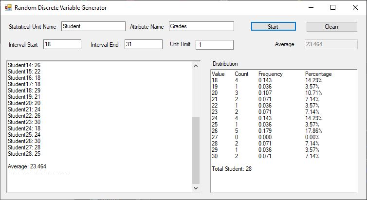
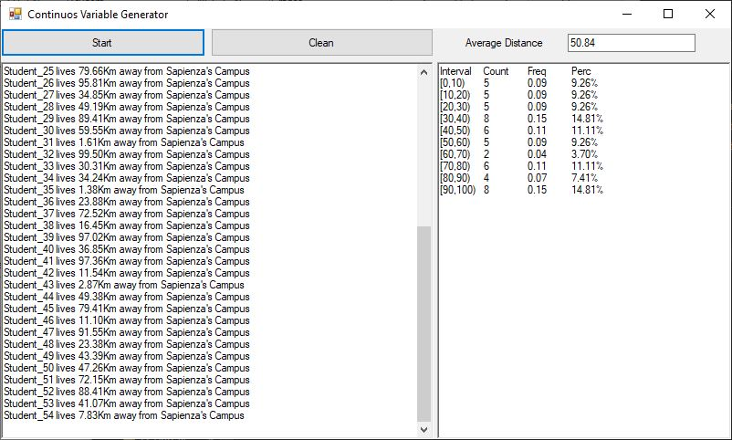
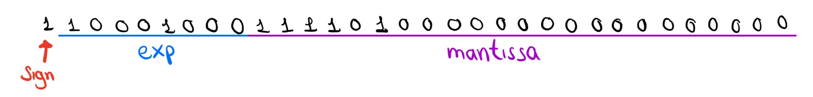

#### Researches about theory (R)

<!-- 4_R. A characteristic (or attribute or feature or property) of the units of observation can be measured and operationalized on different "levels", on a given unit of observation, giving rise to possible different operative variables. Find out about the proposed classifications of variables and express your opinion about their respective usefulness (e.g., https://en.wikipedia.org/wiki/Level_of_measurement, https://www.youtube.com/watch?v=eghn__C7JLQ, https://www.youtube.com/watch?v=jigW0a8cC5c, etc.) -->

4. **Classification of Variables**

    Variables can be classified in the following categories: 
    - **Qualitative**
        - **Nominal:** 
            Differentiates between characteristics based only on their names or categories and other classifications they belong to. There is no clear order between each value.

            Can be useful to measure for example the nationality of the students of an statistics classroom.

        - **Ordinal:**
            Unlike nominal this one allows for a rank order by which the data can be ordered.

            Can be useful to measure data consisting of a spectrum of values like opinions.

    - **Quantitative**
        - **Interval:**
            Is used when hte distance between attributes does have a meaning.

            Can be useful to measure data like temperature.

        - **Ratio:**
            Allows for a meaningful absolute value.
            
            Is useful for measuring data like mass, lenght, duration, etc.


    *Sources:*
    - [Wikipedia: Levels of Measurement](https://en.wikipedia.org/wiki/Level_of_measurement)
    - [Conjointly: Levels of Measurement](https://conjointly.com/kb/levels-of-measurement/)

<!-- 5_R. Describe the most common configuration of data repositories in the real world and corporate environment. Concepts such as Operational or Transactional systems (OLTP), Data Warehouse DW, Data Marts, Analytical and statistical systems (OLAP), etc. Try to draw a conceptual picture of how all these components may work together and how the flow of data and information is processed to extract useful knowledge from raw data. -->

5. **Most common configuration of data repositories in the real world**

    Let's start by giving some definitions: 

    *Online Transaction Processing:* Are systems characterised by a large number of short online transactions, mainly focused on maintaining data integrity.

    *Data Warehouse:* are central repositories that collect data from multiple sources.

    *Data Marts:* are a subsets of the data warehouse that collects information oriented to a specific business line or team.

    *Online Analytical Processing:* Are systems characterized by their low volume of transactions, mainly focused on giving an answer to multidimensional analysis.


    *Sources:*
    - [Wikipedia: OLTP](https://en.wikipedia.org/wiki/Online_transaction_processing)
    - [Wikipedia: Data Warehouse](https://en.wikipedia.org/wiki/Data_warehouse)
    - [Wikipedia: Data Marts](https://en.wikipedia.org/wiki/Data_mart)
    - [Wikipedia: OLAP](https://en.wikipedia.org/wiki/Online_analytical_processing)


<!-- 6_R. Show how we can obtain an online algo for the arithmetic mean and explain the various possible reasons why it is preferable to the "naive" algo based on the definition. -->

6. **How to obtain the online algorithm for arithmetic mean**

    Starting from the naive algorithm we now the arithmetic mean is defined as  
    $$
        \bar{x}_n = \frac{\Sigma_n x_i}{n}
    $$
    that we could rewrite as 
    $$
        n \bar{x}_n = \Sigma_n x_i
    $$
    if we wanted to find $\bar{x}$ at the $n+1$ moment
    $$
        (n+1) \bar{x}_{n+1} =  \Sigma_{n+1} x_i \to
    $$ 
    $$    
        (n+1) \bar{x}_{n+1} = x_{n+1} + \Sigma_{n} x_i
    $$
    $$    
        (n+1) \bar{x}_{n+1} = x_{n+1} + n \bar{x}_n 
    $$
    $$    
        \bar{x}_{n+1} = \frac{ x_{n+1} + n \bar{x}_n }{n+1}
    $$
    $$    
        \bar{x}_{n+1} = \frac{ x_{n+1} + (n+1-1) \bar{x}_n }{n+1}
    $$
    $$    
        \bar{x}_{n+1} = \frac{ x_{n+1} + (n+1) \bar{x}_n - \bar{x}_n}{n+1}
    $$
    $$    
        \bar{x}_{n+1} = \bar{x}_n + \frac{ x_{n+1} - \bar{x}_n}{n+1}
    $$
    thus getting the online algorithm: 
    $$    
        \bar{x}_{n} = \bar{x}_{n-1} + \frac{ x_{n} - \bar{x}_{n-1}}{n}
    $$

    This algorithm is preferred for cases we already know $\bar{x}_n$ instead of applying the naive formula 
    $$    
        \bar{x}_{n+1} = \frac{ x_{n+1} + n \bar{x}_n }{n+1}
    $$
    since computers have limitations when dealing with big decimal point numbers as we'll see later on this paper.

#### Applications / Practice (A)

<!-- 4_A. Create - in both languages C# and VB.NET - a demonstrative program which computes the online arithmetic mean (if it's a numeric variable) and the distribution for a discrete variable (can use values simulated with RANDOM object). -->

4. **Discrete Variable Generator**

    The following program can create a distribution given the interval of the wanted attributes as the example shows: 

    

    [C# Project](https://github.com/AlZeck/statistcsApplicationHomeworks/tree/main/Homework_2/DiscreteVarArithmeticMeanTask1) <span class="px-3" > </span>
    [VB.Net Project](https://github.com/AlZeck/statistcsApplicationHomeworks/tree/main/Homework_2/DiscreteVarArithmeticMeanTask1VB)
 

<!-- 5_A. Create - in your preferred language C# or VB.NET - a demonstrative program which computes the online arithmetic mean (or "running mean") and distribution for a continuous variable (can use random simulated values). Make the code as general and reusable as possible, as it must be used in your next applications and exam.

(In both cases, create your own algorithm, by either inventing it from scratch based on your own ideas, or putting it together by researching everywhere, striving for the most usable and general logic, good efficiency and numerical stability) -->

5. **Continuous Variable Generator**

    The following program creates a random distrbution of student's living distance from the university: 

    

    [C# Project](https://github.com/AlZeck/statistcsApplicationHomeworks/tree/main/Homework_2/ContinuousVarArithmeticMeanTask2)


<!-- 6_A. Create one or more simple sequences of numbers which clearly show the problem with the "naive" definition formula of the arithmetic mean, and explore possible ways to fix that.
Provide alternative algorithms to minimize problems with the floating point representation with simple demos with actual numbers. ( https://en.wikipedia.org/wiki/Kahan_summation_algorithm , https://stackoverflow.com/questions/1930454/what-is-a-good-solution-for-calculating-an-average-where-the-sum-of-all-values-e , https://stackoverflow.com/questions/23813278/how-to-compute-mean-average-robustly, https://www.drdobbs.com/floating-point-summation/184403224, etc. ) -->

6. **Problems with Naive Formula**

```cs
class Program
    {
        static float naive(float[] info)
        {
            float sum = 0.0f;
            foreach (float elem in info)
            {
                sum += elem;
            }
            return sum / info.Length;
        }
        static float knuth(float[] info)
        {
            float avg = 0.0f;
            for (int i = 0; i < info.Length; i++)
            {
                avg += ((float)info[i] - avg) / (i + 1);
            }
            return avg;
        }

        static void Main(string[] args)
        {
            float [] data = { ... };
            // the array data contains 98 integers which 
            // its avg = 634142998897.8148

            Console.WriteLine(naive(data)); // 6.3414285E+11
            Console.WriteLine(knuth(data)); // 6.3414305E+11
        }
    }
```
As shown the naive algorithm is 198897.8148 away from the actual average 

[C# Project](https://github.com/AlZeck/statistcsApplicationHomeworks/tree/main/Homework_2/Task6NaiveFormulaProblems)

    

#### Researches about applications (RA)

<!--  3_RA. Understand how the floating point representation works and describe systematically (possibly using categories) all the possible problems that can happen. Try to classify the various issues and limitations (representation, comparison, rounding, propagation, approximation, loss of significance, cancellation, etc.) and provide simple examples for each of the categories you have identified (e.g., https://floating-point-gui.de/basic/,  https://docs.oracle.com/cd/E19957-01/806-3568/ncg_goldberg.html, http://indico.ictp.it/event/8344/session/50/contribution/207/material/slides/0.pdf , https://stackoverflow.com/questions/2100490/floating-point-inaccuracy-examples, etc.) -->

3. **How Floating Point Representation works**
    
    We know any number can be rewritten in scientific notation as for example
    - $- 0.1 = -1E-1$
    - $1000 = 1E3$
    - $234 = 2.34E2$

    In words we can say 
    $$
        X = n.mantissa * 10^{exponent}
    $$
    with n being the integer part and the mantissa the decimal.


    This works perfectly when we work in a base 10 numeric system but computers work with binary, meaning our formulas would be 
    $$
        X = 1.mantissa * 2^{exponent}
    $$
    $$
        1.mantissa = \frac{X_{bin}}{2^{(exponent)}}
    $$

    Lets try with an example: 
    $$
        - 1000_{10} = - 001111101000_{2}
    $$
    In Base 10 is:
    $$
        - 1000_{10} = - 1 * 10^2
    $$
    mean while in binary:
    $$
       - 1111101000_{2} = - 1.111101 * 2^9
    $$

    With this clear we can introduce the IEEE 745 floating point standard which defines how a given floating point number is stored in computer memory.

    IEEE 745 defines multiple formats depending on the quantity of bits we can use but for simplicity we'll introduce the single precision since is one of the most common now days.

    

    before we can rewrite our last example using this format we must know that the exponent is encoded adding 126 to the original exponent to allow negative integers.

    so our new formula will be: 

    $$
        X = (-1)^{sign} * 1.mantissa * 2^{Exponent-126}
    $$

    applying it to the example $- 1.111101 * 2^9$ this number will be saved as: 

    

    the standard define 2 special cases for the encoded exponent:     
    - $00_H$:
        is used for subnormal numbers to allow even smaller numbers using a new formula: 
        $$
            X = (-1)^{sign} * 0.mantissa * 2^{-126}
        $$

    - $FF_H$: Is interpreted as **N**ot **a** **N**umber meaning the value is undefined or unrepresentable.

    With this in mind we can start talking about the limitations of this presentation: 

    1. It can't properly handle small numbers, in fact $2^-149$ is the smallest number it can represent

    2. Given a big number x this rapresentation wont be able to diferentiate x+1 from x.

    
    <small>Distribution of numbers in a toy floating point system with only three bits for the exponent and mantissa - Cleve Moler</small>

    *Sources:* 
    - [GeekForGeek: IEEE Standart 745 Floating Point Numbers](https://www.geeksforgeeks.org/ieee-standard-754-floating-point-numbers/)
    - [Wikipedia: IEEE 745](https://en.wikipedia.org/wiki/IEEE_754)
    - [Wikipedia: Single precision float](https://en.wikipedia.org/wiki/Single-precision_floating-point_format)
    - [Floating points by Cleve Moler](https://www.mathworks.com/content/dam/mathworks/mathworks-dot-com/company/newsletters/news_notes/pdf/Fall96Cleve.pdf)