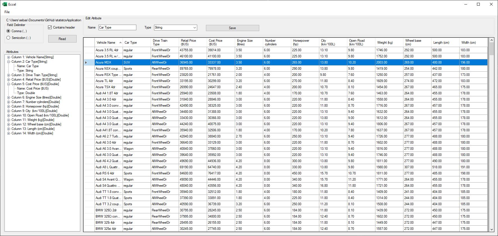

#### Researches about theory (R)

<!-- 7_R. Explain what are marginal, joint and conditional distributions and how we can explain the Bayes theorem using relative frequencies. -->

7. **Marginal, joint and conditional Distribution**

    **Marginal Distribution:** Is the distribution of the variables contained in a subset of given a collection.
    For a bivariate distribution we can give the following definition:
    
    - $P_x (x_i) = \sum_j p(x_i,y_j)$ 
    - $P_y (y_j) = \sum_i p(x_i,y_j)$ 
    
    or as frequencies 
    
    - $Freq(X = x_i) = \sum_j Freq(X = x_i ,Y = y_j )$ 
    - $Freq(Y = y_j) = \sum_i Freq(X = x_i ,Y = y_j )$

    **Joint Distribution:** Given for example two variables $X,Y$ the joint probability for $X,Y$ is the frequency that each variables fall in any particular range or discrete set of values specified for that attribute.

    **Conditional Distribution:** Given a two jointly variables 
    $X,Y$ the conditional distribution of $Y$ given $X$ is the distribution of $Y$ when $X$ is known to be a particular value.

    Mathematically this can be defined as the following equation: 
    - $P(X = x_i | Y = y_j) = \frac{P(X = x_i,Y=y_j)}{P(Y=y_j)}$
    
    or as frequency: 
    - $Freq(X = x_i | Y = y_j) = \frac{Freq(X = x_i,Y=y_j)}{Freq(Y=y_j)}$

    **Bayes' theorem**
    is stated as the following equation
    $$
        P(X|Y) = \frac{P(Y|X) \cdot P(X)}{P(Y)}
    $$

    we know by definition that:
    
    $$Freq(X = x_i | Y = y_j) = \frac{Freq(X = x_i,Y=y_j)}{Freq(Y=y_j)}$$
    $$Freq(Y = y_j | X = x_i) = \frac{Freq(X = x_i,Y=y_j)}{Freq(X = x_i)}$$

    So: 
    $$Freq(X = x_i | Y = y_j) \cdot Freq(Y=y_j) = Freq(Y = y_j | X = x_i) \cdot Freq(X = x_i)$$

    thus: 
    $$Freq(X = x_i | Y = y_j)= \frac{Freq(Y = y_j | X = x_i) \cdot Freq(X = x_i)}{Freq(Y=y_j)}$$

    


    *Sources*
    - [Wikipedia: Marginal Distribution ](https://en.wikipedia.org/wiki/Marginal_distribution)
    - [Wikipedia: Joint Probability Distribution](https://en.wikipedia.org/wiki/Joint_probability_distribution)
    - [Wikipedia: Conditional Probability Distribution](https://en.wikipedia.org/wiki/Conditional_probability_distribution)
    - [Wikipedia: Bayes' Theorem](https://en.wikipedia.org/wiki/Bayes%27_theorem)

<!-- 8_R. Explain the concept of statistical independence and why, in case of independence, the relative joint frequencies are equal to the products of the corresponding marginal frequencies..s. -->
8. **Statistical Independence**

    Two events are statistically independent if the occurrence of one does not affect the probability of occurrence of the others.

    Mathematically we can say 2 events are independent if and only their joint probability equals the product of their probabilities.
    $$
        P(X \cap Y) = P(X) \cdot P(Y)
    $$
    also we can re write saying they are independent if their relative joint frequencies are equal to the product of the correspondent marginal frequency.
    $$
        Freq(X=x_i, Y=y_i)= Freq(X = x_i) \cdot Freq(Y =y_i)
    $$
    This is better explained using the definition of conditional distribution: 
    - By definition the conditional distrbution of $X$ given $Y$, with $X,Y$ independent is equal to the marginal distribution of $X$
        $$
            Freq(X=x_i | Y = y_j) = Freq(X = x_i)
        $$
        since the value of $X$ doesn't depend on the value of $y$
    - And we know for non independent distributions it is
        $$
            Freq(X = x_i | Y = y_j) = \frac{Freq(X = x_i,Y=y_j)}{Freq(Y=y_j)}
        $$
    - thus 
        $$
            Freq(X = x_i | Y = y_j) = Freq(X = x_i)
        $$
        $$
        \Updownarrow
        $$
        $$    
            \frac{Freq(X = x_i,Y=y_j)}{Freq(Y=y_j)} = \frac{Freq(X = x_i) \cdot Freq(Y=y_j)}{Freq(Y=y_j)}
        $$


    *Sources*
    - [Wikipedia: ](https://en.wikipedia.org/wiki/Independence_(probability_theory))


<!-- 9_R. Do a review about charts useful for statistics and data presentation (Example of some: StatCharts.txt ). What is the chart type that impressed you most and why ? -->
9. **Charts: Statistics and data presentation**

    - **Kagi Chart**: Is a chart used for tracking price movements and to make decisions on purchasing stock. It differs from traditional stock charts by being mostly independent of time. This feature aids in producing a chart that reduces random noise.

        
        <br/><small> By [Billw2](https://en.wikipedia.org/wiki/User:Billw2) at the [English language Wikipedia](https://en.wikipedia.org/wiki/),[CC BY-SA 3.0](http://creativecommons.org/licenses/by-sa/3.0/),[Link](https://commons.wikimedia.org/w/index.php?curid=15107393) </small>


    - **Manhattan plot:** Is a type of scatter plot, usually used to display data with a large number of data-points, many of non-zero amplitude, and with a distribution of higher-magnitude values.
    
        
        <br/><small>By M. Kamran Ikram et al - Ikram MK et al (2010) Four Novel Loci (19q13, 6q24, 12q24, and 5q14) Influence the Microcirculation In Vivo. PLoS Genet. 2010 Oct 28;6(10):e1001184. [doi](https://en.wikipedia.org/wiki/Digital_object_identifier):[10.1371/journal.pgen.1001184.g001](https://doi.org/10.1371%2Fjournal.pgen.1001184.g001), [CC BY 2.5](https://creativecommons.org/licenses/by/2.5),[Link](https://commons.wikimedia.org/w/index.php?curid=18056138)</small>

    - **Box plot:** Is a method for graphically depicting groups of numerical data through their quartiles. Box plots may also have lines extending from the boxes (whiskers) indicating variability outside the upper and lower quartiles.

    
    <br/><small>By [Schutz](https://commons.wikimedia.org/wiki/User:Schutz) - Own work, Public Domain, [Link](https://commons.wikimedia.org/w/index.php?curid=1501411)</small>


    - **Streamgraph** Is a type of stacked area graph which is displaced around a central axis, resulting in a flowing, organic shape. Unlike a traditional stacked area graph in which the layers are stacked on top of an axis, in a streamgraph the layers are positioned to minimize their "wiggle". More formally, the layers are displaced to minimize the sum of the squared slopes of each layer, weighted by the area of the layer.

    
    <br/><small> By [Psychonaut](https://commons.wikimedia.org/wiki/User:Psychonaut) - Own work, [CC0](http://creativecommons.org/publicdomain/zero/1.0/deed.en), [Link](https://commons.wikimedia.org/w/index.php?curid=20392905) </small>


    *Sources*
    - [Wikipedia: Kagi Chart](https://en.wikipedia.org/wiki/Kagi_chart)
    - [Wikipedia: Manhattan plot](https://en.wikipedia.org/wiki/Manhattan_plot)
    - [Wikipedia: Box plot](https://en.wikipedia.org/wiki/Box_plot)
    - [Wikipedia: Streamgraph](https://en.wikipedia.org/wiki/Streamgraph)


#### Applications / Practice (A)    

<!-- 7_A. Create - in your preferred language C# or VB.NET - a program which is able to read ANY file CSV (or at least 99% of them), assuming no prior knowledge about its structure (do not even assume to that a first line with variable names is necessarily present in the CSV: when not present, clearly, do some useful automatic naming). The program should use your intelligence, creativity and data checking functions (see references below) to achieve this task. The GUI should display the variables in a control, such as for instance a Treeview (or anything you deem useful, eg, https://docs.microsoft.com/en-us/dotnet/api/system.windows.forms.treeview?view=netcore-3.1 ) and let the user select the data type for each field in the CSV files. Also, some data preprocessing should be carried out on the data (or a suitable subset) in order to empirically establish the most suitable type of data of each field and thus give a preliminary tentative choice of data types for the variable fields to the program user (which he can then change on the GUI at will before reading the file) eg., https://stackoverflow.com/questions/5311699/get-datatype-from-values-passed-as-string/5325687 , https://stackoverflow.com/questions/4208244/get-current-language-in-cultureinfo , https://docs.microsoft.com/it-it/dotnet/api/system.globalization.cultureinfo.currentculture?view=netcore-3.1 ). 

Test the program with several CSV files downloaded from the Internet from various languages (ita, es/us, cn, ...) (eg, https://www.stats.govt.nz/large-datasets/csv-files-for-download/  , https://data.world/datasets/csv , https://support.spatialkey.com/spatialkey-sample-csv-data/ ) to make that values are parsed as intended. 

(For specific date field, the GUI could also let the user specify a custom format in  textbox to read it correctly https://stackoverflow.com/questions/919244/converting-a-string-to-datetime )

[Some hints for the exercise 7_A:
To hold information about variables, you might create a collection of objects each of which represents all the info (eg, name, inferred data type, user selected data type, and so on) gathered about each variable (columns of the CSV file).
To hold the values of each data point (rows of the CSV file), you might define an object which will hold the collection of values, for the respective variables, of each data point. Be careful about missing data. In case you need to catch and process exceptions, you may use the TRY CATCH structure: https://docs.microsoft.com/en-us/dotnet/standard/exceptions/best-practices-for-exceptions ] -->



[Github: CS Project](https://github.com/AlZeck/statistcsApplicationHomeworks/tree/homework3/Homework_3/CSVReaderTask7)
<span style="margin:10px"></span> 
[Download](https://github.com/AlZeck/statistcsApplicationHomeworks/releases/tag/homework3)

<!-- OPT 8_A. In the previous program 7_A, as a verification, plug the code you have already developed for computing the mean and the (univariate) statistical distribution, and allow the user to select any variable and compute the arithmetic mean (only when it makes sense) and the distribution. [Make this general enough, in anticipation of in homework program, where we will also add bivariate distributions and, in general, multivariate distributions, with various charts.] -->


#### Researches about applications (RA)

<!-- 4_RA. Find on the internet all possible ways you can infer a suitable data type, useful for statistical processing, when you are getting data points as a flow of alphanumeric strings ( https://en.wikipedia.org/wiki/Alphanumeric , https://stackoverflow.com/questions/5311699/get-datatype-from-values-passed-as-string/5325687. Be aware of possible format difference due to language.)-->

4. **Infering Data type from alphanumeric strings**

    Lets start by introducing the concept of alphanumerical strings which are a combination of alphabetical and numerical characters, and is used to describe the collection of Latin letters and Arabic digits or a text constructed from this collection.

    Given one, there are several ways in which we could infer the most appropriate representation, one could try for example reading the string and parse it through pattern matching, another approach would be take advantage of the .NET `tryParse()` method an try a brute force approach to the problem, trying to convert it to a type till it success as shown in the following snip of code:

    ```cs
    object ParseString(string str)
    {
        Int32 intValue;
        Int64 bigintValue;
        double doubleValue;
        bool boolValue;
        DateTime dateValue;        

        // Place checks higher in if-else statement to give higher priority to type.

        if (Int32.TryParse(str, out intValue))
            return intValue;
        else if (Int64.TryParse(str, out bigintValue))
            return bigintValue;
        else if (double.TryParse(str, out doubleValue))
            return doubleValue;       
        else if (bool.TryParse(str, out boolValue))
            return boolValue;
        else if (DateTime.TryParse(str, out dateValue))
            return dateValue;
        else return str;
    }
    ```

    *Sources:*
    - [Wikipedia: Alphanumeric](https://en.wikipedia.org/wiki/Alphanumeric)
    - [Stackoverflow: Get datatype from values passed as string](https://stackoverflow.com/questions/5311699/get-datatype-from-values-passed-as-string/5325687)


<!-- 5_RA. Do a research about Reflection and the type Type and make all examples that you deem to be useful. (eg,. http://csharp.net-tutorials.com/reflection/introduction/n/  http://www.codeproject.com/Articles/17269/Reflection-in-C-Tutorial  http://www.codeguru.com/csharp/csharp/cs_misc/reflection/article.php/c4257  http://www.youtube.com/watch?v=C-G7fobbBP0  http://www.codeproject.com/Articles/55710/Reflection-in-NET , etc.-->

5. **Reflection**
    
    Enables the developer to obtain information about loaded assemblies and the types defined within them, such as classes, interfaces, and value types (that is, structures and enumerations). 

    It also allows to dynamically create an instance of a type, bind the type to an existing object, or get the type from an existing object and invoke its methods or access its fields and properties. 

    ``` cs
    // Using GetType to obtain type information:
    int i = 42;
    Type type = i.GetType();
    Console.WriteLine(type);
    ```
    the output is: `System.Int32`

    *Sources:*
    - [.NET Documentation: Reflection in .NET](https://docs.microsoft.com/en-us/dotnet/framework/reflection-and-codedom/reflection)
    - [.NET Documentation: Reflection C#](https://docs.microsoft.com/en-us/dotnet/csharp/programming-guide/concepts/reflection)

<!-- 6_RA. Do a comprehensive research about the GRAPHICS (GDI+ library) object and all its members.-->

6. **Graphics GDI+:** 
    
    Is the class that encapsulates GDI+ drawing surfaces.
    The Graphics class provides methods for drawing objects to the display device. A Graphics is associated with a specific device context.

    An object from this class allows you to draw many different shapes and lines by using methods like: DrawLine, DrawArc, DrawClosedCurve, DrawPolygon, and DrawRectangle.  It can also draw images and icons by using the DrawImage and DrawIcon methods, respectively. In addition, you can manipulate the coordinate system used by the Graphics object. 


    *Sources:*
    - [.NET Documentation: Graphics Class](https://docs.microsoft.com/en-us/dotnet/api/system.drawing.graphics?view=dotnet-plat-ext-3.1#definition)
    - [C# Corner: GDI tutorial](https://www.c-sharpcorner.com/article/gdi-tutorial-for-beginners/)

